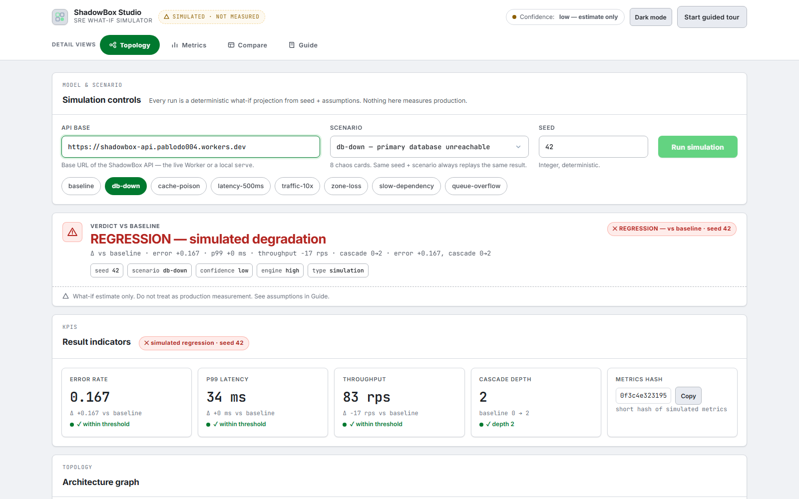
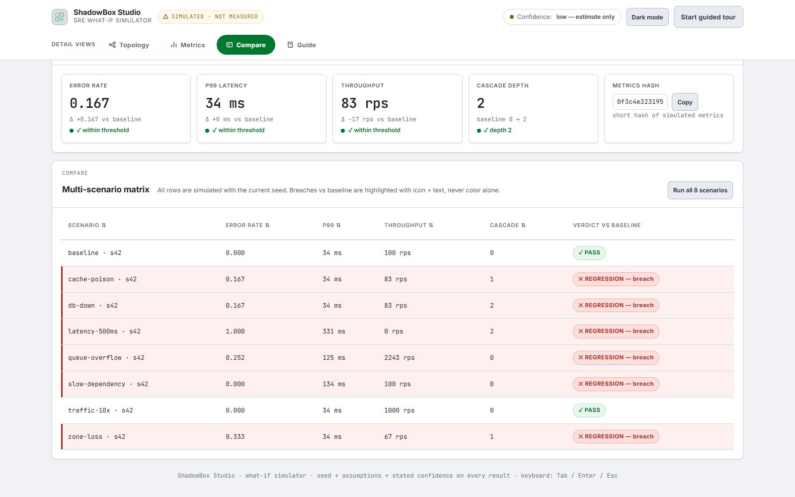

<div align="center">

# ShadowBox

**Model the system. Experiment safely.**

Deterministic what-if simulation for backend architectures: describe services
plus dependencies, inject failures, latency or traffic, and simulate the
outcome without touching production — fully local, no paid services.

[](https://www.python.org/downloads/)
[](LICENSE)
[](https://pypi.org/project/shadowbox/)
[](https://github.com/Pa004/shadowBox/actions)
[](https://shadowbox-api.pablodo004.workers.dev/)

[**Try it live**](https://shadowbox-api.pablodo004.workers.dev/) — no installation required

<figure>
  
  <figcaption><strong>Dashboard:</strong> verdict vs baseline, KPI strip with threshold status, and deterministic metrics hash.</figcaption>
</figure>
<figure>
  
  <figcaption><strong>Compare matrix:</strong> all 8 chaos cards vs baseline, sortable, breaches highlighted with icon + text.</figcaption>
</figure>

</div>

---

## What is ShadowBox?

Production incidents start with questions nobody dares to test live: what if
the database dies for 10 seconds? What if traffic spikes 10×? What if a
dependency slows down? ShadowBox answers with an **executable architectural
model** — a discrete-event simulation (virtual time, seeded RNG, capacity
slots, FIFO/drop queues, timeouts) that turns those questions into numbers:

```text
db-down, seed 42:
    5000/6000 ok, error_rate 0.167, p99 34 ms
    metrics_hash 007952565ac2
    verdict: REGRESSION vs baseline
```

Same model + scenario + seed always yields the same metrics hash. Every
report carries assumptions, limitations, seed, and split confidence
(`engine_confidence: high`, model fidelity `low` unless calibrated) — never
presented as production measurement.

## Quick Start

### Option 1: Web (recommended)

Go to **[shadowbox-api.pablodo004.workers.dev](https://shadowbox-api.pablodo004.workers.dev/)** — live demo
with guided tour, chaos-card catalog, compare matrix and time-travel replay.

### Option 2: Install from PyPI

```bash
pipx install shadowbox
shadowbox init --out demo
shadowbox validate demo/model.yaml --scenario demo/scenarios/db-failure.yaml
shadowbox simulate demo/model.yaml --scenario demo/cards/db-down.yaml --seed 42
```

No clone needed. Requires Python 3.13+. No accounts, no paid services.

### Option 3: From source

```bash
git clone https://github.com/Pa004/shadowBox.git
cd shadowBox
uv venv
uv sync --group dev
uv run pytest
```

## CLI

```bash
shadowbox init                                            # scaffold example + chaos cards
shadowbox validate model.yaml --scenario s.yaml           # exit 0 ok, 3 invalid (E_* codes)
shadowbox simulate model.yaml --scenario s.yaml --seed 42 # deterministic report + hash
shadowbox compare --a base.json --b pr.json               # exit 2 on regression
shadowbox report report.json --format text                # render a saved report
shadowbox import --from docker-compose.yaml               # compose/k8s to model
shadowbox calibrate model.yaml --measurements m.yaml      # scale latencies, capacity, queues
shadowbox serve --port 8000                               # local API on 127.0.0.1
```

Exit codes: `0` ok/pass, `2` scenario regression, `3` invalid input.
`--threshold p99:+10%,error_rate:+1pp` gates CI pipelines.

## API

Local API (`shadowbox serve`, same FastAPI app as the Cloudflare Worker),
paginated `limit`/`cursor` events:

```http
POST /api/v1/models
GET  /api/v1/models/{id}
POST /api/v1/simulations?model_id=...
GET  /api/v1/simulations/{id}
GET  /api/v1/simulations/{id}/events
GET  /api/v1/simulations/{id}/metrics
GET  /api/v1/simulations/{id}/report
```

A public deployment runs on Cloudflare Workers + D1
(`shadowbox-api.pablodo004.workers.dev`). No authentication: bind to
localhost and never expose a private instance directly.

## Benchmarks

Deterministic engine (heapq, 1 ms virtual resolution) on i7-1255U, 16 GB,
no GPU. SLO: 50k events under 2 s.

| Workload | Result |
|---|---|
| checkout db-down (6k reqs, 85k events) | ~0.05 s |
| 60k reqs, 840k events | ~0.6 s |

## Chaos Cards

Seven bundled scenarios with measured seed-42 outcomes (`shadowbox init`
writes them to `cards/`):

| Card | Result |
|---|---|
| `db-down` | error 0.167 → REGRESSION |
| `cache-poison` | error 0.167 → REGRESSION |
| `latency-500ms` | ~total timeouts → REGRESSION |
| `traffic-10x` | absorbed, no errors → PASS (headroom proven) |
| `zone-loss` | error 0.333 → REGRESSION |
| `slow-dependency` | p99 34 → 134 ms, no errors |
| `queue-overflow` | 25% queue-full drops → REGRESSION |

## How It Works

```text
Model (services, capacities, latencies, queues, timeouts)
  → Scenario (workload rate + fault windows + seed)
    → Discrete-event simulation (heapq, seeded RNG, per-component slots)
      → Metrics (throughput, error_rate, p50/p90/p95/p99, timeouts, cascade)
        → Report envelope (hash + assumptions + split confidence)
          → Verdict vs baseline (thresholds + compare matrix)
```

Calibration (`calibrate`) scales latency base, capacity, and queue size from
measured medians with per-parameter evidence and a ≤3-pass convergence loop;
`medium` model confidence requires post-simulation agreement (p50 ±15%,
error ±2pp, throughput ±10%). Known-config parameters (topology, timeouts,
workload, queue policy) are never scaled.

## Project Structure

```text
shadowbox/
├── src/shadowbox/         # engine, dsl, cli, model, metrics, report, cards,
│                          #   calibrate, api, store (SQLite) + dstore (D1)
├── src/shadowbox/data/    # canonical example + chaos cards (shipped in wheel)
├── schemas/               # model-v1.json, scenario-v1.json
├── apps/web/              # static demo with replay (no build)
├── apps/studio/           # React + Vite + Cytoscape.js UI
├── tests/                 # unit, deterministic (golden), property, integration
└── scripts/               # vendor-worker.ps1 (Worker bundling)
```

## Development

```bash
uv sync --group dev
uv run pytest -q
uv run ruff check . && uv run mypy src
cd apps/studio && npm install && npm run build
```

Every slice ships on a branch (`feat/...`, `fix/...`, `docs/...`) with a
green suite before merging to `master`. Spec and agent notes (`ShadowBox.md`,
`AGENTS.md`) are local-only by design and never committed.

## Contributing

1. Fork the repo
2. Create a feature branch (`git checkout -b feat/my-feature`)
3. Make changes with tests
4. Run the checks above
5. Open a PR against `master`

## License

[Apache-2.0](LICENSE)
