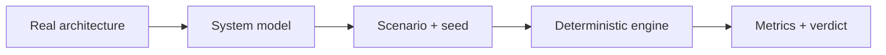

# ShadowBox — model the system. Experiment safely.

[](https://github.com/Pa004/shadowBox/actions/workflows/ci.yml)
[](https://pypi.org/project/shadowbox/)
[](https://www.python.org/downloads/release/python-3130/)
[](https://github.com/Pa004/shadowBox/blob/master/LICENSE)

**What breaks if the database dies for 10 seconds? What if traffic spikes 10×?**
ShadowBox answers without touching production: describe your architecture, inject the failure, and simulate — deterministically, reproducibly, for free.

| | |
|---|---|
| 🎛️ **Live Studio** | https://shadowbox-avg.pages.dev — dashboards, multi-scenario matrix, guided tour |
| ⚡ **Live API + demo** | https://shadowbox-api.pablodo004.workers.dev — try it right now, no install |
| 📦 **Install** | `pipx install shadowbox` — runs anywhere, no clone needed |
| 📄 **Releases** | https://github.com/Pa004/shadowBox/releases |

```powershell
uvx shadowbox==0.3.2 init --out demo
uvx shadowbox==0.3.2 simulate demo/model.yaml --scenario demo/cards/db-down.yaml --seed 42
# done: 5000/6000 ok, error_rate=0.167, p99=34ms, hash=007952565ac2
```

Same model + scenario + seed always yields the same metrics hash. Simulation output always carries assumptions, confidence, and seed — **never presented as production measurement**.

## Why it exists

Diagrams don't execute. Load tests need real environments. Chaos tools bill you and break things for real. ShadowBox sits in between: an **executable architectural model** for safe what-if experiments — a flight simulator for backends, a lab bench for SRE students.



## Chaos cards (bundled, measured values)

| Card | What it does | Measured result (seed 42) |
|---|---|---|
| `db-down` | database unavailable 10 s | 1000 failed, error 0.167 → REGRESSION |
| `cache-poison` | cache unavailable 10 s | 1000 failed, error 0.167 → REGRESSION |
| `latency-500ms` | +500 ms on database | ~total timeouts (505 ms > 500 ms timeout) |
| `traffic-10x` | 100 → 1000 rps | absorbed, no errors — headroom proven |
| `zone-loss` | cache + database down 20 s | 2000 failed, error 0.333 → REGRESSION |
| `slow-dependency` | cache +100 ms | 0 errors, p99 34 → 134 ms |
| `queue-overflow` | 3000 rps for 10 s | 25% queue-full drops |

```json
{
  "seed": 42,
  "metrics": { "error_rate": 0.167, "latency_ms": { "p99": 34 } },
  "metrics_hash": "007952565ac2…",
  "assumptions": ["sync calls only", "…"],
  "confidence": "low",
  "calibration_source": "none"
}
```

## Use it your way

- **CLI** — `validate`, `simulate`, `compare` (exit 2 on regression — CI-ready), `report`, `import` (compose/k8s), `init`, `serve`.
- **API** — FastAPI, 7 endpoints, paginated events, SQLite locally / D1 on Cloudflare.
- **Studio** — React + Cytoscape dashboards, compare matrix, time-travel replay, guided tutorial.
- **CI check** — `shadowbox compare --a base.json --b pr.json --threshold p99:+10%,error_rate:+1pp` fails the build on architectural regressions.

## How it works

Virtual-time discrete-event engine (heapq, 1 ms resolution, isolated seeded RNG). Requests traverse the dependency graph through per-component capacity slots, FIFO/drop queues, and timeouts; faults (unavailable, latency, error-rate, capacity reduction, saturation) apply in windows. Throughput: ~840k events in 0.6 s on an i7 laptop (SLO: 50k < 2 s).

```text
src/shadowbox/         # model, dsl, cli, errors, engine, metrics, report, cards, api, store
src/shadowbox/data/    # canonical example + chaos cards (shipped in the wheel)
schemas/               # model-v1.json, scenario-v1.json
tests/                 # unit, deterministic (golden seed 42), property, integration
apps/web/              # static demo with replay (no build)
apps/studio/           # React + Cytoscape UI (Vite, strict TS)
```

Verified: `ruff` + strict `mypy` clean, 46 pytest green (golden hash, Hypothesis invariants, API integration), CI on every push, deterministic local↔cloud.

## Develop

```powershell
uv python pin 3.13
uv venv
uv sync --group dev
uv run ruff check .; uv run mypy src; uv run pytest
```

Work happens on `feat/*` branches, merged green into `master`. No paid service and no credit card at any tier — local, PyPI, and Cloudflare free tiers only.

## License

Apache-2.0. Built by [Pablo Domínguez](https://github.com/Pa004).
